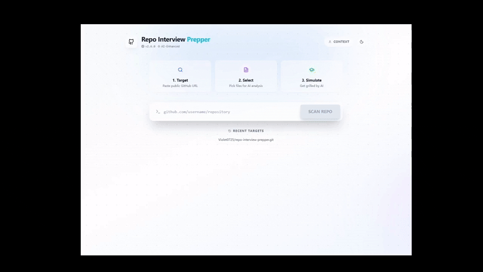

# Repo Interview Prepper

Repo Interview Prepper is an AI-powered web application designed to help developers prepare for technical interviews. By analyzing a specific GitHub repository, the tool generates tailored interview questions—ranging from architectural decisions to specific code implementations—simulating a real-world technical deep dive.

## 🌐 Website

Try it out: **[repo-interview-prepper.vercel.app](https://repo-interview-prepper.vercel.app)**

## 🎬 Demo



## 🚀 Features

* **Repository Analysis**: Scans public GitHub repositories to extract file structure, README context, and key source code.
* **AI Question Generation**: Uses OpenAI's `gpt-4o-mini` to generate relevant questions based on the actual code context.
* **Adaptive Modes**: Choose between Technical, Behavioral, or Mixed question styles.
* **Mock Interview Simulation**: Interactive chat mode to practice answers with AI feedback.
* **Secure Architecture**: Uses a Vercel Serverless Function to proxy API calls, keeping your OpenAI API key hidden from the client-side.
* **Modern UI**: Fully responsive design with Dark/Light mode, glassmorphism effects, and Tailwind CSS.

## 🛠️ Tech Stack

* **Frontend**: React 19, Vite, Tailwind CSS, Lucide React
* **Backend**: Node.js (Vercel Serverless Functions with Edge Runtime)
* **AI Integration**: OpenAI API (`gpt-4o-mini`) with SSE streaming
* **Testing**: Vitest, React Testing Library, jsdom
* **Deployment**: Vercel

## 📂 Project Structure

```
repo-interview-prepper/
├── api/
│   ├── chat.js          # Serverless backend proxy (Securely calls OpenAI)
│   └── chat-stream.js   # Streaming API endpoint (SSE for real-time responses)
├── public/              # Static assets (favicon, etc.)
├── src/
│   ├── components/      # Modular UI components
│   │   ├── Navbar.jsx
│   │   ├── RepoInput.jsx
│   │   ├── FileSelector.jsx
│   │   ├── QuestionCard.jsx
│   │   ├── MockChat.jsx       # Streaming chat component
│   │   ├── ResultsDashboard.jsx
│   │   ├── ContextPanel.jsx
│   │   └── ui/
│   │       └── SkeletonLoader.jsx
│   ├── hooks/           # Custom React hooks
│   │   ├── useTheme.js
│   │   ├── useGitHub.js
│   │   └── useRecentSearches.js
│   ├── services/        # API service layer
│   │   ├── github.js    # GitHub API interactions
│   │   └── ai.js        # OpenAI API with streaming support
│   ├── utils/
│   │   └── markdown.jsx # Markdown rendering utilities
│   ├── test/
│   │   └── setup.js     # Vitest test configuration
│   ├── App.jsx          # Main orchestration component
│   ├── main.jsx         # Entry point
│   └── index.css        # Global styles & Tailwind directives
└── vitest.config.js     # Testing configuration
```

## 🧪 Testing

The project includes a comprehensive test suite using Vitest and React Testing Library:

```bash
# Run tests in watch mode
npm test

# Run tests once
npm run test:run

# Run tests with coverage report
npm run test:coverage

# Run tests with UI
npm run test:ui
```

**Test Coverage:**
- Unit tests for services (GitHub API, AI service)
- Hook tests (useTheme, useRecentSearches)
- Component tests (QuestionCard, RepoInput, markdown utilities)

## ⚡ Real-time Streaming

The Mock Interview Mode features **real-time streaming responses** using Server-Sent Events (SSE):
- Token-by-token AI feedback display
- Visual streaming indicator
- Abort capability for long responses

## 🛡️ Architecture & Security

This project implements a Backend-for-Frontend (BFF) pattern to handle sensitive API interactions securely:

1. **Frontend (React)**: Handles user interaction, state management, and repository scanning logic.
2. **Serverless Proxy (Node.js)**: A dedicated endpoint (`/api/chat`) that acts as a secure gateway.
3. **Security**: The OpenAI API Key is stored exclusively in server-side environment variables (`OPENAI_API_KEY`), ensuring it is never exposed to the client browser.